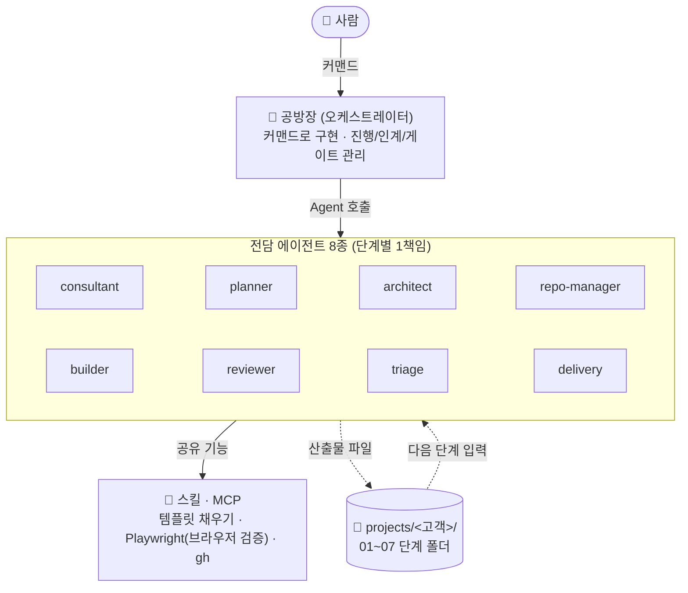
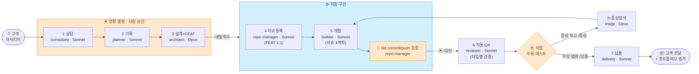

# IT상상공방 (IT Make Some)

> 고객의 상상을 **빠르게 확인 가능한 MVP**로 만들어주는 AI 자동 생산 공방.

막연한 아이디어가 들어오면, **8종의 전담 AI 에이전트**가 단계별로 협업해
**웹 / 앱 / 자동화 프로세스** 형태의 MVP로 만들어 *"이 가설이 맞나요?"* 를 가장 빠르게 검증한다.
목표는 "완벽한 제품"이 아니라 **잘못된 가설에 쏟을 시간을 아끼는 것**이다.

---

## 🧩 왜 IT상상공방을 만들었는가

AI 코딩은 작은 작업에서는 매우 빠르다. 하지만 프로젝트가 커질수록 하나의 AI가
기획·설계·구현·검증을 한 맥락에 모두 떠안으면서 **문맥이 비대해지고 역할이 섞이는** 문제를
경험했다. 앞 단계의 결정이 뒤로 갈수록 흐려지고, 어디서 틀어졌는지 추적하기 어려워진다.

그래서 사람 조직이 일하는 방식을 빌렸다. 한 AI가 다 하는 대신 **기획자(Planner)·개발자(Builder)·
검수자(Reviewer)처럼 역할을 분리**하고, 각 역할이 **정해진 산출물 문서로만 다음 단계에 인계**하는
**AI 개발 시스템(생산 라인)**으로 바꿨다. 좁은 책임을 가진 에이전트들이 계약처럼 이어받으니,
각 단계는 자기 일에만 집중하고 사람은 가치 있는 길목(방향 결정·검증)에서만 개입하면 된다.

---

## 🏗️ 공방의 3계층 구조

에이전트는 서로 직접 호출하지 않는다. **인계는 항상 공방장을 거치고, 산출물 파일이 단계 간 유일한 통신 수단**이다.



---

## 🔄 생산 라인 — 7단계 파이프라인



- **휴먼 게이트는 세 곳**: ① 방향 결정(상담·기획·설계+FEAT) ② **QA 진입 승인**(Git 원격 반영 확인 후 `/승인`) ③ 실사용 검증(사람 수동 테스트). 그 사이는 모두 자동.
- 4단계 GitHub 관리자가 설계를 **이슈로 박제**하고, 이슈를 닫기 전 **코드를 원격에 commit/push**해 흐름을 잃지 않는다.
- 수동 테스트에서 나온 증상은 증상분석가(triage)가 재현·분석 → 자동 수정 순환으로 처리한다.

---

## 🤖 에이전트 8종

| 단계 | 에이전트 | 모델 | 한 줄 책임 | 특수 권한 |
|------|----------|------|-----------|-----------|
| 1 | **consultant** | Sonnet | 고객 요구사항을 듣고 구조화 (형태 단정 금지) | — |
| 2 | **planner** | Sonnet | 요구사항 → PRD, MVP 스코프 컷 | — |
| 3 | **architect** | **Opus** | 형태·스택 결정 + **FEAT 문서 생성** (가장 중요한 분기점) | WebFetch/Search |
| 4 | **repo-manager** | Sonnet | 이슈 등록(FEAT 1:1) + **commit/push/close** (공방 내 유일한 Git 쓰기) | `gh` · `git push` |
| 5 | **builder** | Sonnet | FEAT 문서대로 MVP 구현 (이슈 1개씩, **최소 문서만 읽음**) | push 차단(훅) |
| 6 | **reviewer** | Sonnet | **프로젝트 타입별** 실행 검증 (웹/앱/API/문서) | Playwright MCP |
| ↻ | **triage** | **Opus** | 증상 재현·분석 → 수정 이슈 초안 | Playwright MCP |
| 7 | **delivery** | Sonnet | 실행 안내·고객 전달문 + 증거·생산성 요약 패키징 | — |

> **모델 배치 원칙**: 무거운 판단(설계·증상)만 **Opus**, 나머지는 **Sonnet**. builder를 Sonnet으로 두는 대신 **FEAT 문서 품질·승인 게이트를 강화**한다.

---

## 🎛️ 운영 흐름 (공방장 커맨드)

```
/신규프로젝트 <이름>          # _template 복제 → 상담 시작
   └─ /다음단계 <이름>  ×3    # 상담 → 기획 → 설계+FEAT (한 단계씩, 사람 승인)
/개발착수 <이름>              # 이슈등록 → 개발 루프 → Git 반영 검증 (QA 진입 전 정지)
   └─ /승인 <이름>           # ▣ Git 원격 반영 확인 후 자동 QA 시작
        └─ (사람 수동 테스트)
            ├─ /증상 <이름> "증상"   # 버그 → triage 분석 → 자동 수정 순환
            └─ /납품 <이름>          # 이상 없음 → 납품 + 증거·생산성 요약
보조: /개발재개 <이름> (중단 복원) · /되돌리기 · /이슈동기화
```

---

## 🆕 v2 공정 개선 (PickUpMemo v1 실기기 검증 후 반영)

v1을 실제로 돌리며 확인된 병목·빈틈을 바탕으로 **공정을 최적화**했다. (상세: [`docs/operations/공정개선-v2.md`](docs/operations/공정개선-v2.md))

| # | v1에서 확인된 문제 | v2 해법 |
|---|------------------|---------|
| 1 | Builder 토큰 소모가 컸음 | builder **Opus→Sonnet** + **최소 문서**(이슈+FEAT+헌법 3개)만 읽기 |
| 2 | 이슈마다 참조 문서 범위가 넓어 탐색 비용 발생 | **FEAT 문서 ↔ 이슈 1:1 매칭** (이슈 #N ↔ `FEAT-NN`), 이슈 본문은 FEAT만 참조 |
| 3 | 이슈는 닫혔는데 코드가 원격에 push 안 된 빈틈 | repo-manager **commit/push 먼저 → close 나중** + **QA 진입 Git 검증 게이트(`/승인`)** |
| 4 | 웹과 Android의 QA 방식이 같았음 | reviewer **프로젝트 타입별 QA 분기** (웹/앱/API/문서) |
| 5 | 포트폴리오 증거를 수동 수집 | delivery가 **증거자료 체크리스트 자동 생성** |
| 6 | 토큰/시간/중단 기록 체계 없음 | **생산성요약.md** + **progress.md**(중단/재개 프로토콜 `/개발재개`) 정식화 |

**게이트 변화**: 2곳(방향 결정·실사용 검증) → **3곳**(+ QA 진입 승인).
**핵심 전환**: 비싼 판단(설계/FEAT)은 앞에서 한 번 무겁게, 싼 실행(개발)은 뒤에서 여러 번 가볍게.

---

## 📊 공방 현황 (Dashboard)

> 만들고 끝난 결과물이 아니라, **기록된 지표로 개선되는 개발 시스템**.

| 항목 | 현재 |
|------|------|
| 제작 형태 | **웹 · 앱 · 자동화** 3종 |
| 실운영 | **AI-Morning-Brief** 매일 04:30 무인 가동 (일간+주간) |
| 운영 공정 | **v2** — FEAT 1:1 · 최소 문서 · Git 게이트 · 타입별 QA |
| 현재 실험 | 기획·설계는 Claude, Builder는 로컬 모델이 **분담**하는 구조 (검증 중) |

---

## 🧪 현재 실험 — 역할 분담형 Builder 구조

Claude가 **기획·설계**를 맡고, **Builder 작업을 로컬 모델이 분담**하는
**역할 분담형 Builder 구조(Hybrid Builder)** 를 검증 중이다.
Claude를 대체하는 게 아니라, 무거운 판단과 반복 구현을 **나눈다.**

- **실험 환경**: opencode + LM Studio (원격 로컬 모델)
- **목표**: 서비스 단위 병렬 개발 + 외부 토큰 비용 절감
  *(상상공방의 지향은 비용 절감이 아니라 **생산성 향상**이며, 비용 절감은 그 효과다.)*

### 공정 진화 방향
로컬 모델 성능이 검증되면 FEAT 문서를 **서비스 단위**로 작성하고,
**서비스 단위로 분리된 FEAT마다 독립적인 Builder를 배치하여
여러 기능을 동시에 구현하는 병렬 생산 라인**으로 확장한다.

---

## 🔻 Builder 토큰 효율 — v1 → v2 개선 비교

Builder 모델을 가볍게 했을 때 **같은 기능을 더 적은 토큰으로** 만들 수 있었다.
데이터 포인트가 2개인 **단발 개선 비교**다("성장곡선" 아님).

```
v1 (Opus)    ████████████████████████████  ≥ 58.6k   (기록된 대표 5개 · 하한값)
v2 (Sonnet)  █████████████████████          42.9k     (14개 호출 실측)
                                            최소 −26.8% (보수적 하한)
```

> 산식·전체 수치 근거 → [docs/research/PickUpMemo_v1_v2_생산성비교.md](docs/research/PickUpMemo_v1_v2_생산성비교.md)

이 결과를 바탕으로 **Builder는 반드시 최고 성능 모델일 필요는 없다는 가설**을 세웠고,
현재 **역할 분담형 Builder 구조(Hybrid Builder)** 를 검증하고 있다.

---

## 🗂️ 제작 사례 — 한 공정, 세 가지 형태

공방의 핵심 주장은 "형태를 고정하지 않는다"이다. 실제로 같은 7단계 공정에서 **웹·앱·자동화 세 형태**의 MVP가 나왔다.

| 프로젝트 | 형태 | 한 줄 | 검증 수준 |
|----------|------|-------|-----------|
| **AI-Morning-Brief** | 자동화 | 매일 아침 AI 트렌드를 선별해 Discord로 보내는 무인 파이프라인 | launchd 실운영 중 (일간+주간) |
| **PickUpMemo v3** | Android 앱 | 배차 화면 위에 가게 메모 + 실제 경로 거리·시간을 단일 팝업으로 | 실기기 동작 검증 |
| **PawprintDiary** | 웹앱 | 보호자가 반려동물의 일상을 기록하면 AI가 해석·요약하고, 떠난 뒤엔 기록을 잇는 회고 채팅(무지개연결)으로 이어지는 웹앱 | 일기 MVP 납품 완료 · 무지개연결 모드 개발 중 |

> 형태는 3단계(설계)에서 "가장 빠르게 확인시킬 수 있는 형태"로 결정된다.
> UI가 불필요하면 헤드리스 자동화로, 시스템 권한이 필요하면 네이티브 앱으로 간다.

---

## 📈 PickUpMemo v1 → v2 생산성 개선 사례

> 상상공방 v2는 단순히 AI에게 코드를 시킨 것이 아니라,
> **요구사항 정의 → 로그 기반 기술검증 → PRD → FEAT 분해 → GitHub Issue → Builder 구현 → 빌드 검증 → 커밋/푸시/이슈 종료 → 실기기 검증**까지 이어지는 AI 기반 MVP 제작 프로세스다.
> **PickUpMemo v2**는 이 프로세스가 실제로 동작했음을 보여주는 대표 사례다.

배달 라이더가 배차 화면에서 식당 메모를 자동으로 보고 싶다는 아이디어 — 이를 v1에서 **기술 가능성으로 검증**하고, v2에서 **실사용 MVP로 전환**했다.

### v1 — 기술검증용 Log Collector

v1은 사용자 기능 제공이 아니라, 배민커넥트 화면의 접근성 로그를 수집해 **"업체명을 읽어올 수 있는가"라는 기술 가설을 검증**하는 도구였다.

- Android Accessibility Service 기반 화면 텍스트 수집 / Notification Listener 기반 알림 로그 수집
- 패키지명 · 접근성 텍스트 · ContentDescription · View ID 수집
- 테스트 알림 생성 · 접근성 테스트 화면 · 로그 보기 · 로그 내보내기
- 실제 배민커넥트 신규 배차 카드에서 **픽업지 / 푸라닭 신림점 / 전달지** 패턴 확인, 패키지명 `com.woowahan.bros` 확인
- → **접근성 로그 기반 업체명 추출이 가능하다**는 기술 가설 검증 성공

**한계**: 실사용 메모 관리·매칭·오버레이 팝업 없음. 로그 수집과 가능성 검증에 집중. 이슈 수가 많고 **Builder 호출당 토큰 소모가 컸음.**

### v2 — 실사용 MVP

v2는 v1에서 검증한 로그 패턴을 바탕으로 만든 **실사용 MVP(사용자 테스트 APK)**다.

- Accessibility Service 기반 배민커넥트 신규 배차 카드 감지 → **픽업지 / 업체명 / 전달지** 패턴에서 업체명 후보 추출
- **Room 기반 로컬 메모 저장 + 메모 CRUD** (상호명 · 지점명 · 메모내용 · 태그)
- 상호명 + 지점명 contains 기반 강한 매칭 / 동일 메모 ID 기준 **30초 중복 팝업 억제**
- **WindowManager 기반 오버레이 팝업** (6초 자동 닫힘, 태그 없으면 태그 영역 미표시)
- 접근성 권한 안내 · 다른 앱 위에 표시 권한 안내 · 테스트/검증 화면
- 배민커넥트 패키지 필터 기반 디버그 로그 저장/조회/내보내기
- 최종 APK 빌드 → **실기기에서 접근성 이벤트 기반 메모 매칭 및 오버레이 팝업 표시 확인 → 실제 사용자에게 APK 전달**

### 기능 범위 비교

| 항목 | v1 | v2 |
|------|----|----|
| 목적 | 배민커넥트 접근성/알림 로그 수집 검증 | 실제 라이더용 메모 팝업 MVP |
| 주요 기능 | 접근성 로그 수집, 알림 로그 수집, 로그 보기/내보내기, 테스트 알림 | 메모 CRUD, 업체명 추출, 메모 매칭, 오버레이 팝업, 권한 안내, 테스트 화면, 배민 로그 보관 |
| Builder 모델 | Opus | Sonnet |
| Builder 평균 토큰 | ≥58.6k | 42.9k |
| 개선폭 | — | 최소 −26.8% |
| 개발 구조 | FEAT 1:1 매칭 없음 | Issue ↔ FEAT 1:1 매칭 |
| 검증 방식 | 로그 수집 가능성 확인 | APK 빌드, 실기기 팝업 검증, 사용자 전달 |

> ⭐ **v2는 v1보다 기능 범위가 넓어졌음에도 Builder 평균 토큰이 감소했다.** 메모 CRUD·매칭·오버레이·권한 안내·테스트 화면·로그 보관함까지 사용자 기능이 더 늘어났는데도, Builder 호출당 평균 토큰은 오히려 줄었다.

### Builder 평균 토큰 비교

```
v1 (Opus)    ████████████████████████████  ≥ 58.6k  (기록된 대표 5개 기준 · 하한값)
v2 (Sonnet)  █████████████████████          42.9k    (전체 14개 호출 실측)
                                             ────────
                                             최소 −26.8% (보수적 하한)
```

- v2 = 전체 **14개 호출 실측 평균 42.9k** (확정값, 범위 27.4k~63.1k).
- v1 = **기록이 남은 대표 5개로 산출한 58.6k**이며, **미기록 v1 작업들이 기록분보다 더 무거웠으므로 실제 v1 평균은 이보다 높다.**
- 따라서 **−26.8%는 보수적인 하한값**이고, 실제 개선폭은 그 이상일 가능성이 높다.

**해석**: Builder 호출당 평균 토큰을 **최소 27% 절감**했다. 또한 Builder 모델을 **Opus → Sonnet**으로 낮췄기 때문에, 토큰 절감뿐 아니라 **모델 단가 인하 효과까지 더해져 실행 단계 비용 절감폭은 더 크다.** (정확한 비용 배수는 임의 계산하지 않음 — 토큰 실측만 확정.)

### 개선 전략 (왜 효율이 좋아졌는가)

1. **FEAT 1:1 매칭** — GitHub Issue 하나가 FEAT 문서 하나와 직접 연결. Builder는 해당 이슈와 매칭 FEAT만 읽고 구현.
2. **이슈 압축** — v1보다 이슈 단위를 명확하게 재구성. 불필요한 반복 작업과 넓은 문맥 탐색 감소.
3. **최소 문서 읽기** — Builder가 전체 문서를 다 읽지 않고 헌법 / 해당 이슈 / 매칭 FEAT 중심으로 작업.
4. **역할 분리** — Architect가 무거운 판단·설계를 담당, Builder는 FEAT 문서 기준으로 구현에 집중.
5. **모델 전략** — 무거운 설계 판단은 Opus, 반복 구현은 Sonnet. 즉 **반복 비용이 큰 Builder 구간을 경량 모델로 전환.**
6. **Shell Execution Gate** — 하위 에이전트의 Bash 실행이 제한되는 환경에서, `gh`/`git`/`gradle`/build/push/issue close는 공방장 오케스트레이터가 실행하고 Builder는 코드 작성에 집중. 공방장이 빌드 검증·커밋·푸시·이슈 종료를 담당.
7. **작업상태 인계 문서** — 세션 중간 종료에 대비해 `작업상태.md`(progress)에 완료 이슈·커밋 해시·마지막 빌드 상태·다음 착수 지점을 기록. 세션 초기화 이후에도 이어받기 가능.

### 트레이드오프 (정직하게)

v2에서 Builder 평균 토큰은 줄었지만, **Architect 단계의 토큰은 크게 증가**했다 (설계 31.8k → **228.6k**, FEAT 13개 작성). 이는 우연이 아니라 **무거운 판단을 설계 단계로 옮기고 반복 구현 비용을 줄이기 위한 의도적인 구조**다. 즉 **반복 비용인 Builder 토큰을 1회성 설계 비용으로 치환**한 전략이다.

> **무거운 추론은 설계 게이트로 이동시키고, 반복 구현은 경량 모델이 수행하도록 분리했다.**

| 단계 | v1 | v2 |
|------|----|----|
| 상담 (Sonnet) | 21.6k | 34.1k |
| 기획 (Sonnet) | 23.0k | 21.3k |
| 설계 (Opus) | 31.8k | **228.6k** (FEAT 13개) |
| 자동 QA (Sonnet) | — | 89.7k |
| 납품 (Sonnet) | 59.8k | 67.3k |

### 결과

- v1에서 **가능성을 검증**하고, v2에서 **프로세스를 최적화**해 실제 사용자에게 전달 가능한 MVP로 전환했다.
- Builder 호출당 평균 토큰 **최소 −27%**, 모델 단가 인하까지 더해 실행 단계 비용을 구조적으로 절감.
- 기능 범위는 넓어졌고, APK 빌드·실기기 팝업 검증·사용자 전달까지 완주.

> **PickUpMemo v2의 핵심 성과는 단순한 앱 구현이 아니라, AI 에이전트가 실제 MVP 개발 흐름을 안정적으로 수행할 수 있도록 작업 단위·권한 경계·검증 루프·세션 인계 체계를 설계하고 실전에서 검증한 것이다.**

(상세 수치·산식: [`docs/research/PickUpMemo_v1_v2_생산성비교.md`](docs/research/PickUpMemo_v1_v2_생산성비교.md))

---

## 🔧 사례: AI-Morning-Brief — 실운영 중인 자동화

공방이 자기 자신을 위한 내부 도구도 같은 공정으로 만들었다. RSS를 모아 Claude로 선별하고 매일 아침 Discord 브리핑을 보내는 자동화 파이프라인으로, **현재 매일 04:30 launchd로 무인 운영 중**이다. "데모가 한 번 됨"을 넘어 **"매일 알아서 돎"**까지 도달한 사례로, 공정이 납품 이후 실운영까지 이어짐을 보여준다. (형태: 자동화 · 일간+주간 리포트)

---

## 📚 핵심 문서

| 문서 | 내용 |
|------|------|
| [`CLAUDE.md`](CLAUDE.md) | 공방 헌법 — 모든 에이전트가 따르는 최상위 규칙 (절대 원칙 9개) |
| [`docs/architecture/architecture.md`](docs/architecture/architecture.md) | 설계도 — 오케스트레이션 구조, 에이전트 명세, 범위 강제 메커니즘 |
| [`docs/architecture/pipeline.md`](docs/architecture/pipeline.md) | 생산 라인 7단계 상세 (입출력·완료조건) |
| [`docs/operations/공정개선-v2.md`](docs/operations/공정개선-v2.md) | v2 변경사항 요약 |
| [`docs/research/PickUpMemo_v1_v2_생산성비교.md`](docs/research/PickUpMemo_v1_v2_생산성비교.md) | v1→v2 Builder 토큰 생산성 비교 (실측) |

---

## 📁 디렉토리

```
IT_make_some/
├── CLAUDE.md          # 공방 헌법
├── docs/              # 공방 OS 문서 (목적별 4분류) — 인덱스: docs/README.md
│   ├── architecture/  # 시스템 구조 청사진 (architecture · pipeline)
│   ├── operations/    # 운영·개선·거버넌스 (운영개선-issues · OPS-01 · 공정개선-v2)
│   ├── research/      # 측정·근거 (생산성 비교 실측)
│   └── validation/    # 라인 검증 절차 (검증가이드)
├── .claude/
│   ├── agents/        # 전담 에이전트 8종
│   ├── commands/      # 공방장 커맨드 9종
│   ├── rules/         # 단계별 작업 규칙 7종 (paths 스코프)
│   └── hooks/         # push/gh 차단 훅
├── templates/         # 산출물 템플릿 (FEAT·이슈본문·progress·증거·생산성 등)
└── projects/
    ├── _template/      # 신규 프로젝트 골격 (7단계 폴더 + features/ + progress.md)
    ├── PickUpMemo/     # 사례 v1: 기술검증용 Log Collector (접근성 로그 가설 검증)
    ├── PickUpMemo_v2/  # 사례 v2: 실사용 MVP (메모 매칭·오버레이 팝업, 실기기·사용자 전달)
    ├── dday-test/      # 사례: 웹
    └── sangsang-lite/  # 실험 프로젝트: 상상공방 Lite (아이디어 → 검증할 것으로 변환)
```

> **실험 프로젝트 — 상상공방 Lite**: 아이디어를 "만들 것"이 아니라 "먼저 확인할 것"으로 바꾸는 경량 검증 공방.
> 기획 문서는 [`projects/sangsang-lite/`](projects/sangsang-lite/README.md) 참조. (본 공방과 목적이 다른 별도 실험)

---

## ✅ 현재 상태: v2 가동

- [x] 공방 헌법 / 설계도 / 파이프라인 / **v2 개선 문서**
- [x] 단계별 규칙 7종 · 전담 에이전트 8종 · 공방장 커맨드 9종 · 산출물 템플릿 14종
- [x] 권한 강화 (settings.json + push/gh 차단 훅, repo-manager만 Git 쓰기)
- [x] 사례 검증: **dday-test**(웹) · **PickUpMemo v1**(기술검증) · **PickUpMemo v2**(실사용 MVP, 실기기·사용자 전달)
- [x] **v2 공정**: FEAT 1:1 매칭 · 최소 문서 · Git 검증 게이트 · 타입별 QA · 증거/생산성 기록 · 중단/재개
- [x] **생산성 실측**: PickUpMemo v1→v2 Builder 평균 토큰 ≥58.6k → 42.9k (최소 −26.8%)

**다음 프로젝트부터** v2 공정이 자동 적용된다. 기존 사례 산출물은 그대로 보존.
